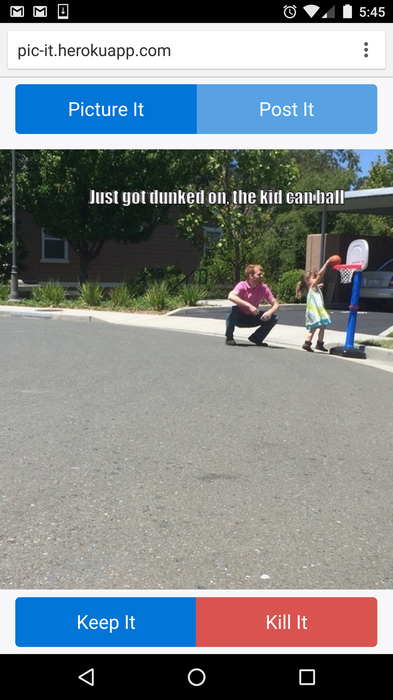

# PictureIt
PictureIt is all about sharing what is happening right now! You can only upload pictures taken with your phone or tablet's camera, and old pictures are replaced upon the submission of a new picture.

## Installation
```
> git clone https://github.com/its-swats/PictureIt.git
> rake db:create
> rake db:migrate
> rails s
> open http://localhost:3000
```
##Usage

[Deployed to Heroku](http://pic-it.herokuapp.com)



## Known Issues
* Images are deleted when the Heroku Dyno shuts down
* UI does not look great in Landscape mode


## Update Plans
* Rework UI for Landscape mode and larger tablets
* ~~Add Test Suite~~
* ~~Grant pictures protection/'lives' based on Keep/Kill vote ratio~~
* ~~Reworked UI for Desktop~~
* ~~Better image scaling~~
* ~~Better handling of captions~~

## Technologies Used
* CarrierWave for Image Uploading
* MiniMagick for Image Compression and Captioning
* Ruby, Rails, postgres, and Javascript+jQuery
* Bootstrap v4 Alpha for UI

## Contributing
1. Fork it!
2. Create your feature branch: `git checkout -b my-new-feature`
3. Commit your changes: `git commit -am 'Add some feature'`
4. Push to the branch: `git push origin my-new-feature`
5. Submit a pull request!

## History
* 5/15/16 - Votes matter! Pictures cannot be replaced until Kills + Upload Attempts > Keeps. Also added tests, and error handling through modals for when an image cannot be uploaded. 
* 5/14/16 - Desktop UI Information page is now live, and made a few UI tweaks
* 5/12/16 - Images are now compressed on upload, and caption text is placed on the image itself
* 5/11/16 - Fixed issue with crashing on launch when no records exist
* 5/7/16 - Initial release

## License
MIT License